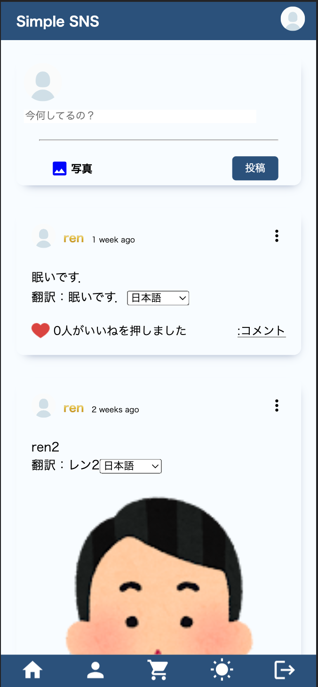
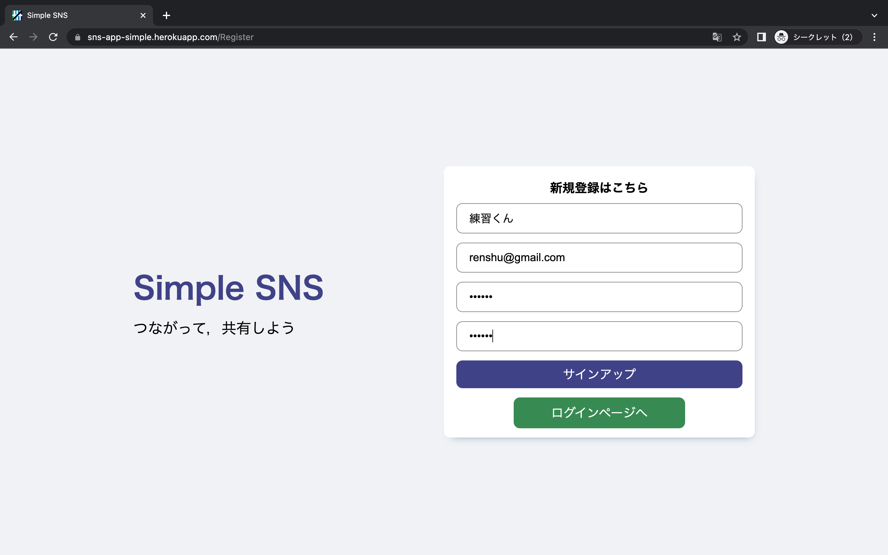
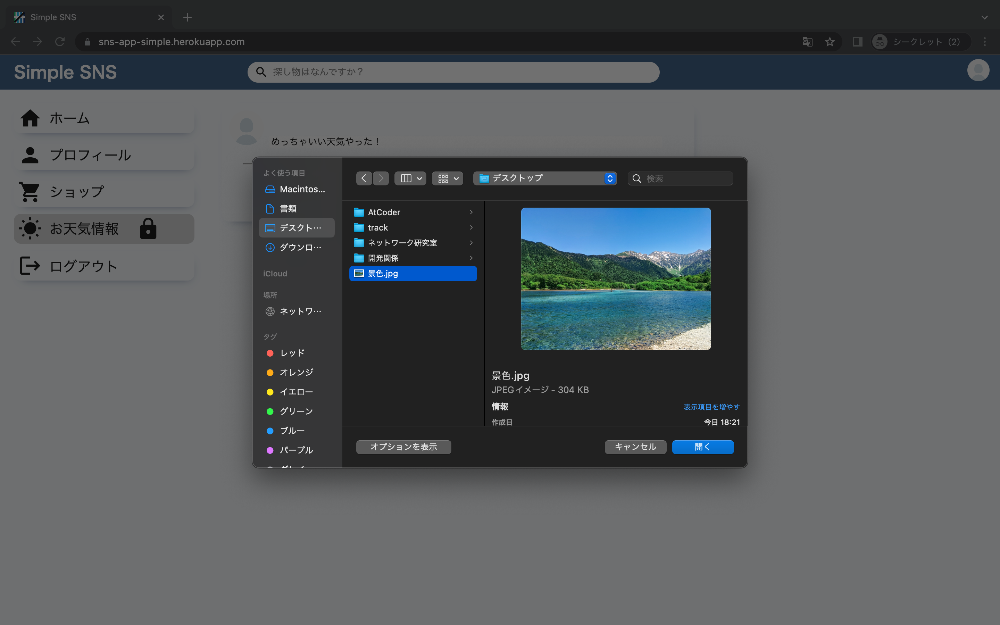
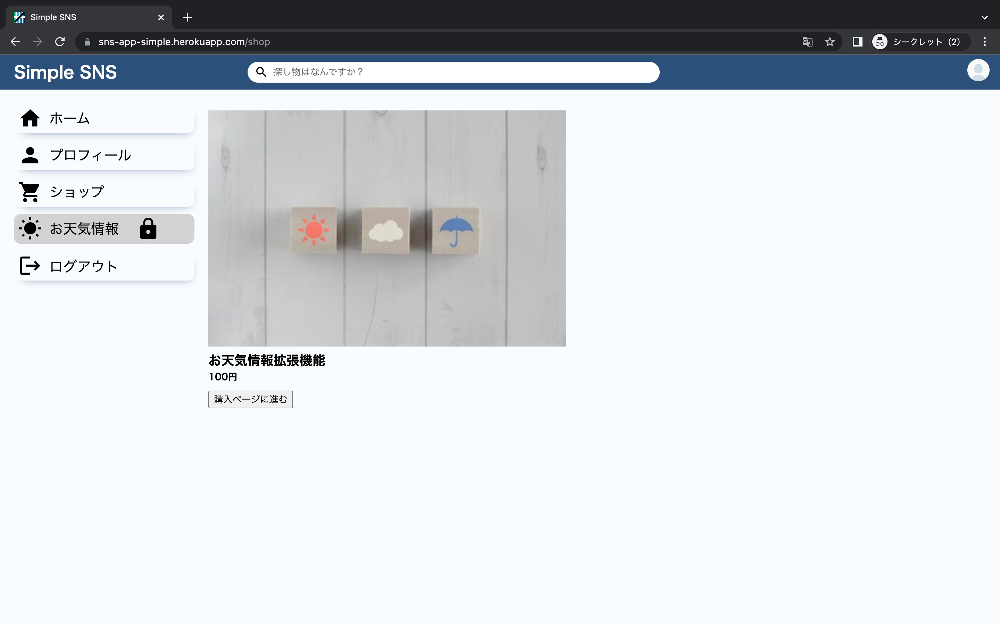
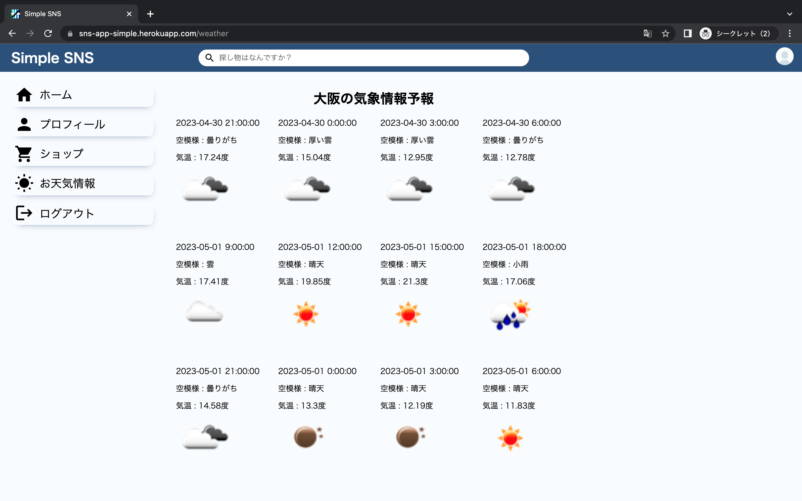

# リンク
https://sns-app-simple.herokuapp.com/login

 

# 更新履歴
1\. README作成(2023/4/21)

2\. レスポンシブ対応(2023/4/23)

3\. 処理のかかる場所においてスピナー作成(2023/4/24)

# 使用方法
1\. Registerページでアカウントを登録．

 

2\. loginページで登録したアカウントのメールアドレスとパスワードを入力しHOME画面へ．

 

3\. 投稿する文章を入力し画像を選択して投稿．

 

4\. またshopページでお天気情報機能を買うことができます．(デモなので無料です．)

5\. カード情報は番号を4242 4242 4242 4242と入力し，他は適当に入力すると購入できます．(デモ)

6\. 最後にこちらが，購入したお天気情報ページです．

